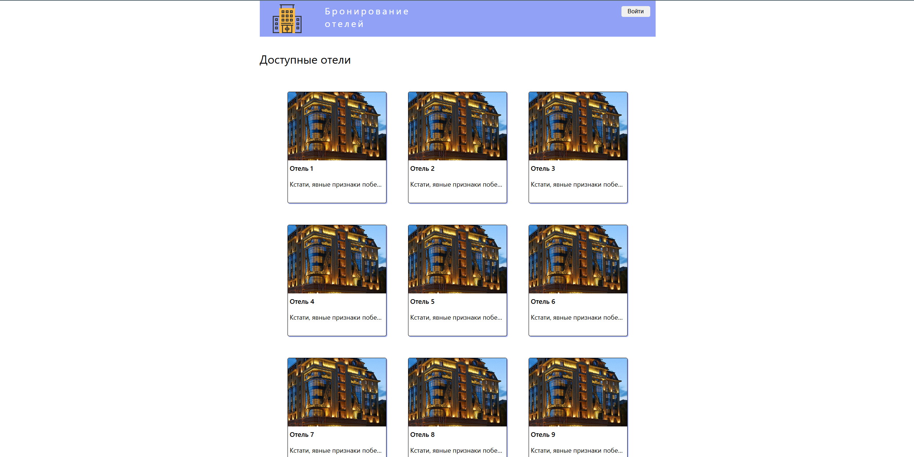
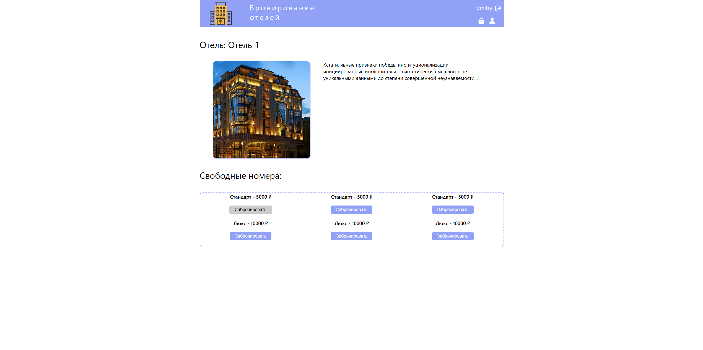
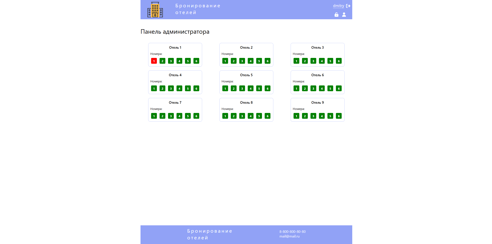

# Сервис бронирования номеров 

Веб-приложение для бронирования отелей с личным кабинетом пользователя и админской панелью. Реализован backend на Node.js и frontend на React. Сайт размещён на собственном сервере.

- **Демо:** [http://85.198.81.221:3008/](http://85.198.81.221:3008/)

##  Стек технологий

### Фронтенд:
- React
- Redux
- React Router DOM
- JavaScript
- Vite

### Бэкенд:
- Node.js
- Express
- MongoDB
- Mongoose
- JSON Web Token (JWT) — авторизация
- Роли пользователей (админ / клиент)

### Инфраструктура:
- Docker
- Timeweb Cloud

##  Функциональность

### Для пользователей:
- Регистрация и вход (через JWT)
- Роли: клиент / админ
- Просмотр доступных номеров
- Бронирование номера
- Просмотр своих броней
- Удаление бронирования

### Для администратора:
- Доступ только при авторизации
- Панель управления номерами
- Изменение статуса номеров (доступен / забронирован)

##  Превью

### Главная страница

### Страница отеля

### Панель администратора

### Личный кабинет

##  Установка и запуск (локально)

### Backend

- cd server
- npm install
- node index.js

#### MongoDB должен быть запущен локально или в Docker:

- docker run -d -p 27023:27017 --name booking-db mongo

### Frontend

- cd bookings
- npm install
- npm run dev

